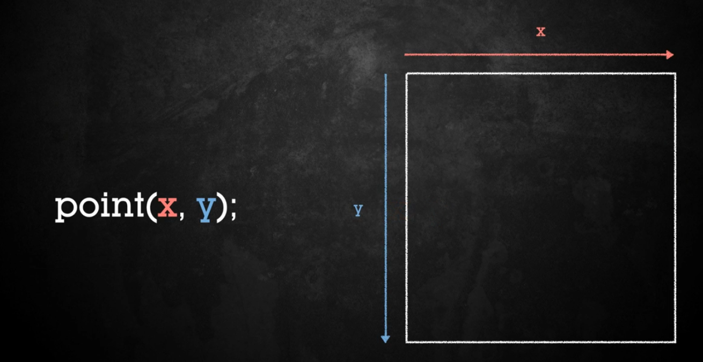
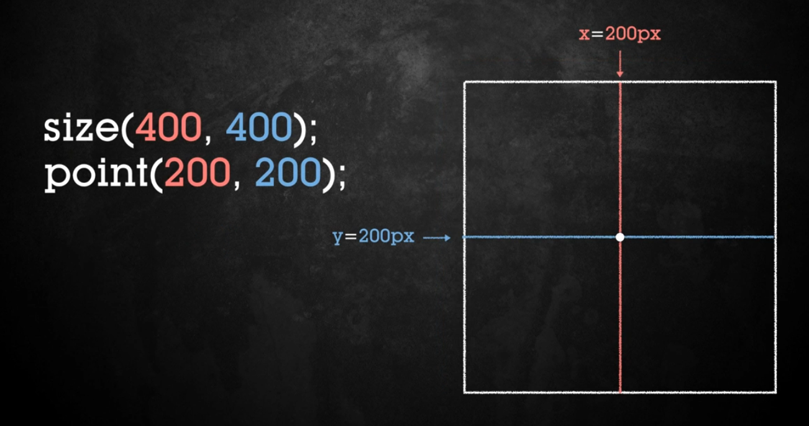
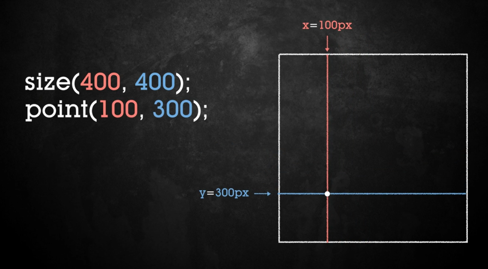
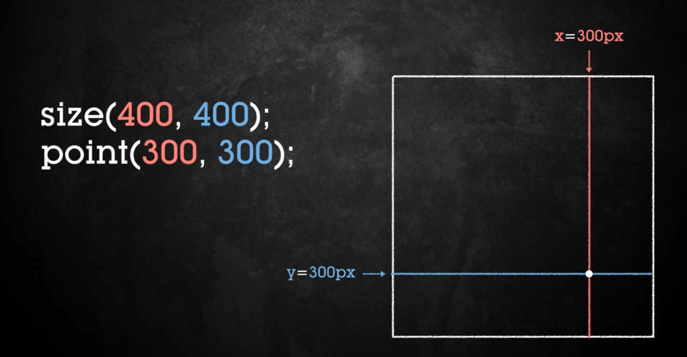

# Función point - dibujar un punto

```java
// funcion point - dibujar punto

//point(x,y) en 2D
```



## Ejemplos

### 1. El punto en el medio de la pantalla
```java

void setup(){
  size(400,400);
  point(200,200); // el punto está en el medio
}
```



### 1. El punto a mano izquierda
```java

void setup(){
  size(400,400);
  point(100,300);
}
```



### 1. El punto a mano derecha
```java

void setup(){
  size(400,400);
  point(300,300);
}
```

