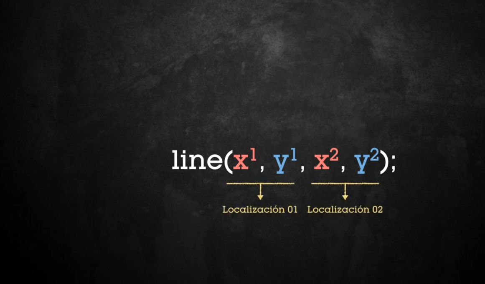
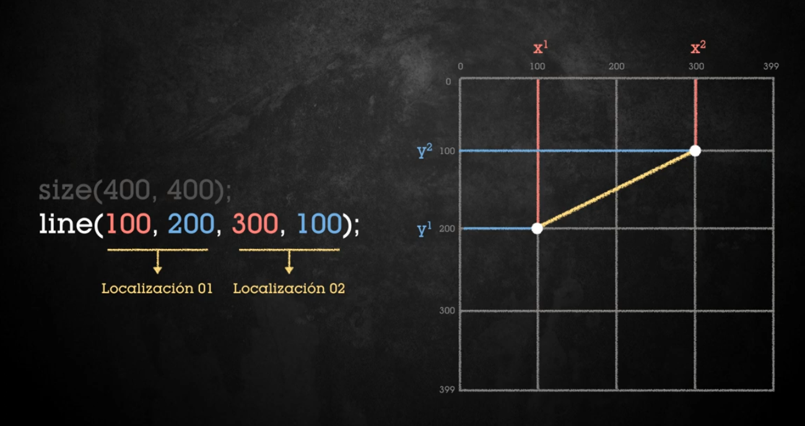
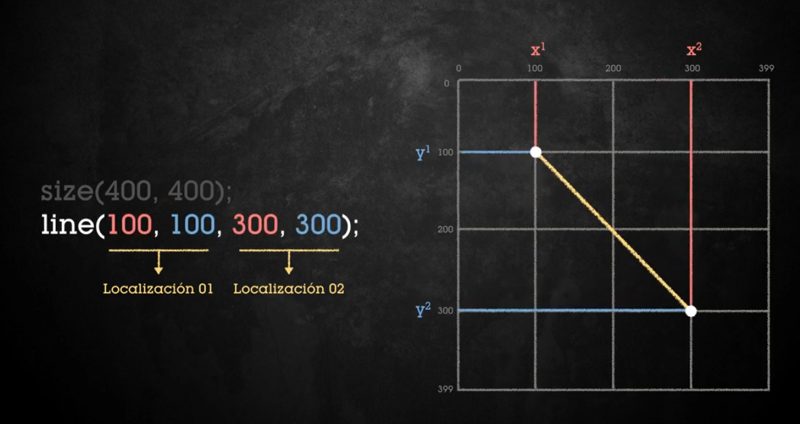
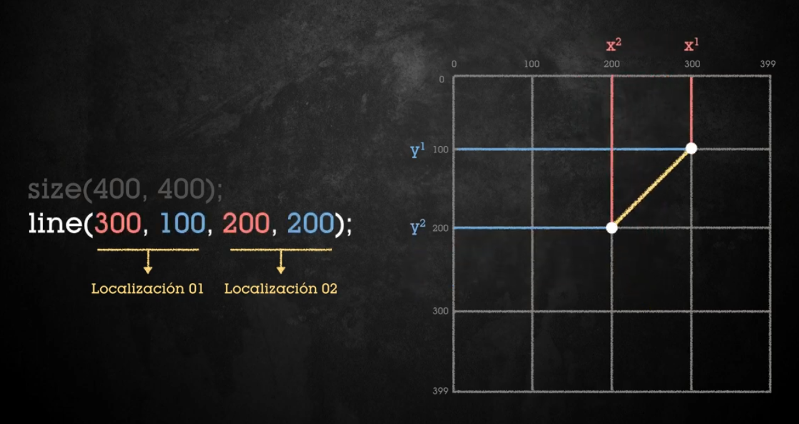

# Función line - dibujar una línea
```java
// funcion line - dibujar linea
/*line(x1,y1,x2,y2) x1 e y1 -> localización 01
                    x2 e y2 -> localización 02
                    localización = punto
*/
```



## Ejemplo 1

```java
void setup(){
  size(400,400);
//line(x1, y1, x2, y2);
  line(100,200,300,100); // x1 e y1 -> localización 01  y  x2 e y2 -> localización 02
  line(100,100,300,300); 
  line(300,100,200,200); 
}
```



## Ejemplo 2

```java
void setup(){
  size(400,400);
  line(100,100,300,300); 
}
```



## Ejemplo 3

```java
void setup(){
  size(400,400);
  line(300,100,200,200); 
}
```



